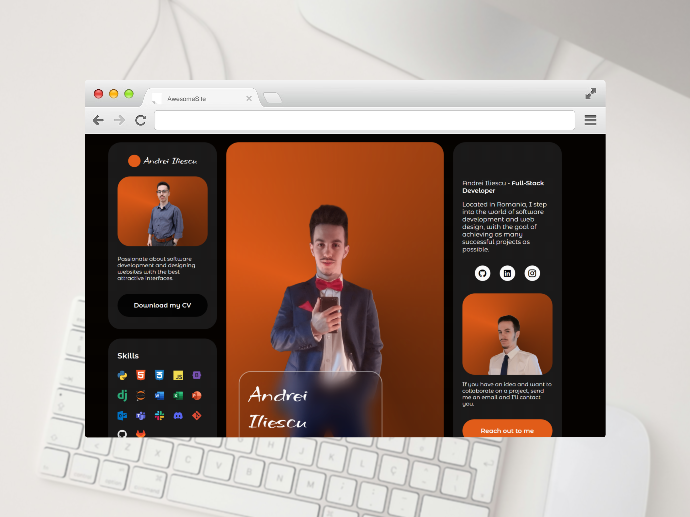

# 🌐 Personal Portfolio Website of Andrei Iliescu

---

## 📋 Table of Content
- 🏷️ [Project Description](#project-description)
- 💻 [Live Preview](#live-preview)
- 📷 [Screenshots](#screenshots)
- ✨ [Features](#features)
- 🛠️ [Technologies](#technologies)
- 🗂️ [Project Structure](#project-structure)
- 💾 [Installation](#installation)
- 🫱🏻‍🫲🏼 [Contributing](#contributing)
- 📜 [License](#license)
- 👨🏻‍💻 [Author](#author--acknowledgments--contact) / 🙏🏻 [Acknowledgments](#author--acknowledgments--contact) / 📩 [Contact](#author--acknowledgments--contact)
- 💰 [If you want to support me](#if-you-want-to-support-me)

---

## Project Description
This repository contains the source code of my personal portfolio website.  
It is designed to showcase my projects, skills, and experience in a clean and modern way.
<!-- ## Badges -->

---

## Live Preview
[⛓️‍💥 Portfolio](https://andrei-iliescu-portfolio.netlify.app/)

---
## Screenshots
<p align="center">
   
   
</p>

<br>

<p align="center">
   
   
</p>

<br>

<p align="center">
   
   
</p>

<br>

<p align="center">
   
</p>

<br>

---

## Features
- Responsive design (works on desktop and mobile).
- Projects showcase with screenshots and details.
- Contact form powered by EmailJS.
- Smooth animations with ScrollReveal.
- Organized structure for easy maintenance.

---

## Technologies
- **HTML5**
- **CSS3**
- **JavaScript (ES6+)**
- [ScrollReveal](https://scrollrevealjs.org/) for animations
- [EmailJS](https://www.emailjs.com/) for contact form

---

## Project Structure
- │ 📁 portfolio/
- ├── index.html
- ├── more-projects.html
- ├── assets/
- │ ├── css/
- │   └── style.css
- │ ├── js/
- │   └── main.js
- │   └── scrollreveal.min.js
- │ ├── img/
- │   └── portfolio-img
- │   └── previews
- │   └── projects-mockups
- │   └── svg
- │ ├── pdf/
- │   └── ATS_CV_ANDREI_ILIESCU_EN.pdf
- ├── screenshots
- │   └── webpage-portfolio-mockup.png
- │   └── webpage-more-projects-mockup.png
- │   └── desktop-portfolio-mockup.png
- │   └── laptop-portfolio-mockup.png
- │   └── phone-portfolio-mockup.png
- │   └── tablet-portfolio-mockup.png
- │   └── personal-website-portfolio-mockup.png
- ├── .gitignore
- ├── LICENSE
- └── README.md # Project documentation
<!-- ## Requirements -->
<!-- ## Usage -->
<!-- ## Configuration -->
<!-- ## Running tests -->
<!-- ## Deployment -->
<!-- ## Notes -->
<!-- ## Road Map -->
<!-- ## FAQ -->

---

## Contributing
Pull requests are welcome.
For major changes, please open an issue first to discuss what you’d like to change.
<!-- ## Changelog -->

---

## Installation
1. Clone the repository:
```bash
git clone https://github.com/xAndreiix/https://github.com/xAndreiix/Personal_Portfolio_Website
```

---

## License
This project is licensed under the MIT License - see the [LICENSE](LICENSE)

---

## Author / Acknowledgments / Contact
**Author:** 
Andrei Iliescu

[](https://andrei-iliescu-portfolio.netlify.app/)

**Acknowledgments:**  
- Inspired by [Bedimcode](https://www.youtube.com/@Bedimcode) tutorial on YouTube.

[](https://www.youtube.com/watch?v=vHxVWdMUYo0&t=595s&ab_channel=Bedimcode)
- All thanks to him for the training and examples!

**Contact:**  

[](https://linkedin.com/in/andrei-iliescu-aa7910214)<br>
[](mailto:andrey_iliescu@yahoo.com)<br>
[](mailto:andrei.iliescu13102000@gmail.com)

---

## If you want to support me
[](https://paypal.me/xAndreiix)<br>
[](https://revolut.me/xandreiix)
